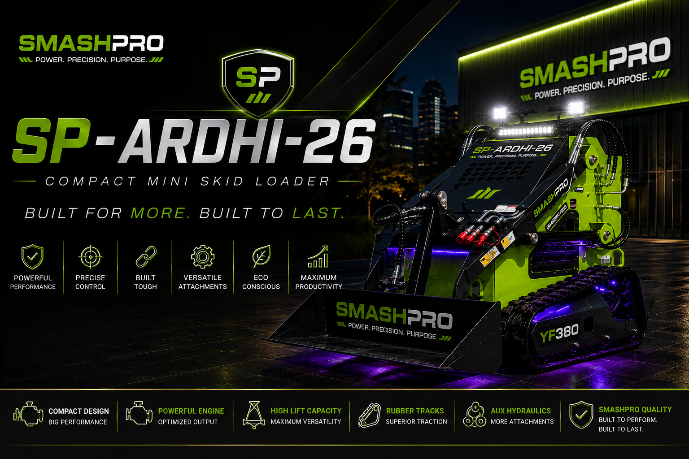
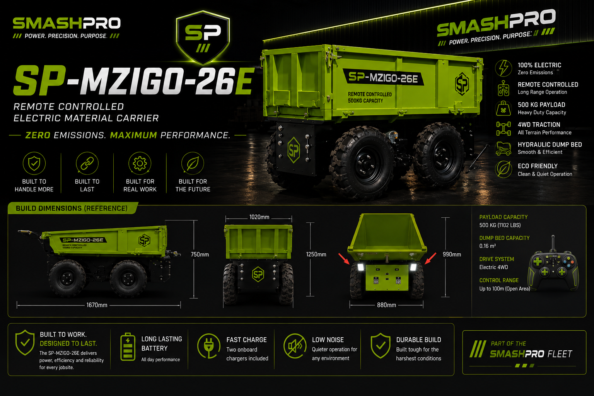
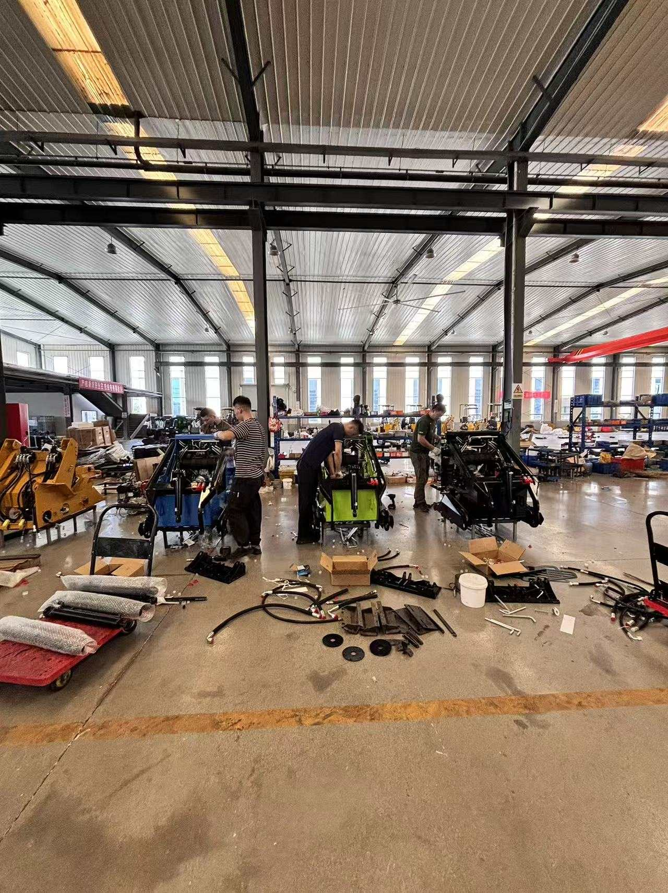
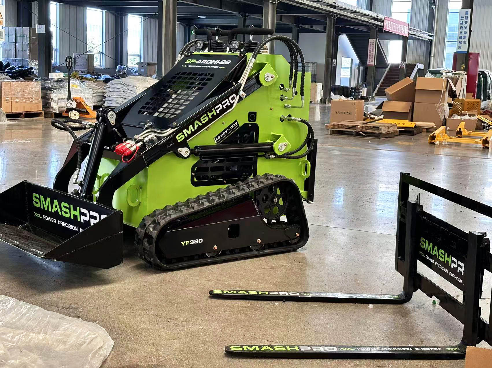
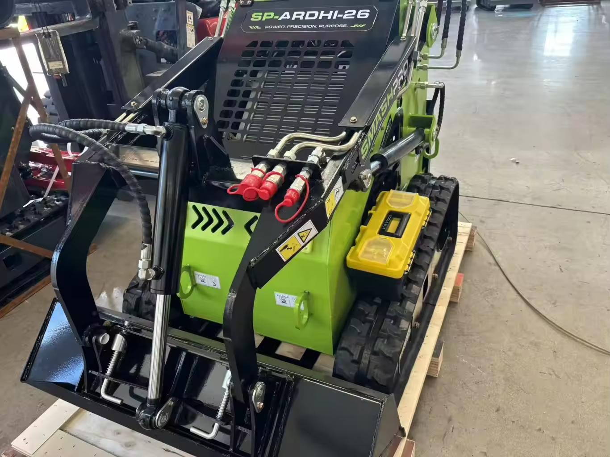

<p align="center">
  <a href="https://smashpro.app/equipment/">
    
  </a>
</p>

<h1 align="center">SmashPro Equipment Showroom</h1>

<p align="center">
  <strong>Public fleet catalog, equipment passports, factory media, and lifecycle documentation for the SmashPro Fleet.</strong>
</p>

<p align="center">
  <a href="https://smashpro.app/equipment/"><strong>View Live Showroom</strong></a>
  &nbsp;•&nbsp;
  <a href="docs/fleet/README.md">Fleet Passports</a>
  &nbsp;•&nbsp;
  <a href="docs/deployment.md">Deployment Guide</a>
  &nbsp;•&nbsp;
  <a href="docs/adding-equipment.md">Add Equipment</a>
</p>

<p align="center">
  
  
  
  
</p>

---

## The Fleet

<table>
  <tr>
    <td width="50%" align="center" valign="top">
      <a href="https://smashpro.app/equipment/sp-ardhi-26.html">
        
      </a>
      <br />
      <strong>SP-ARDHI-26 · ARDHI</strong><br />
      Compact Tracked Loader / Mini Skid Steer<br />
      <em>Power. Precision. Purpose.</em><br /><br />
      <a href="https://smashpro.app/equipment/sp-ardhi-26.html">Live Passport</a> ·
      <a href="docs/fleet/SP-ARDHI-26-PASSPORT.md">Fleet Record</a>
    </td>
    <td width="50%" align="center" valign="top">
      <a href="https://smashpro.app/equipment/sp-mzigo-26.html">
        
      </a>
      <br />
      <strong>SP-MZIGO-26E · MZIGO</strong><br />
      Remote Electric Material Transporter<br />
      <em>Compact electric material movement.</em><br /><br />
      <a href="https://smashpro.app/equipment/sp-mzigo-26.html">Live Passport</a> ·
      <a href="docs/fleet/SP-MZIGO-26E-PASSPORT.md">Fleet Record</a>
    </td>
  </tr>
</table>

## From Factory Floor to Field

The repository is more than a product list. Each machine builds a traceable visual history from procurement and factory production through shipping, upgrades, attachments, maintenance, and field service.

<table>
  <tr>
    <td width="33%" align="center">
      <br />
      <sub><strong>BUILD</strong> · Factory assembly</sub>
    </td>
    <td width="33%" align="center">
      <br />
      <sub><strong>VERIFY</strong> · Completed configuration</sub>
    </td>
    <td width="33%" align="center">
      <br />
      <sub><strong>TRACK</strong> · Shipping preparation</sub>
    </td>
  </tr>
</table>

## Fleet Registry

Every SmashPro fleet ID is permanent. Owned equipment and future acquisitions share the same Passport structure so specifications, sourcing, lifecycle changes, attachments, and supporting evidence stay organized in one system.

| Fleet ID | Equipment | Lifecycle | Record |
| --- | --- | --- | --- |
| **SP-ARDHI-26** | Compact tracked loader / mini skid steer | Owned fleet | [Passport](docs/fleet/SP-ARDHI-26-PASSPORT.md) |
| **SP-MZIGO-26E** | Remote electric material transporter | Owned fleet | [Passport](docs/fleet/SP-MZIGO-26E-PASSPORT.md) |
| **SP-BEBA-HD-26** | Heavy-duty equipment trailer | Future acquisition | [Passport](docs/fleet/SP-BEBA-HD-26-PASSPORT.md) |
| **SP-INAMA-26** | Low-profile hydraulic tilt/lowering equipment trailer | Future acquisition | [Passport](docs/fleet/SP-INAMA-26-PASSPORT.md) |
| **SP-NYASI-26** | Remote-controlled lawn mower | Future acquisition | [Passport](docs/fleet/SP-NYASI-26-PASSPORT.md) |

> Future-acquisition Passports are planning records. They are not exposed as owned, rentable, or bookable fleet assets until acquisition status changes.

## What Lives Here

- **Public showroom** built with React, Vite, and TypeScript.
- **Equipment Passports** with identity, verified specs, attachments, upgrades, lifecycle history, and supporting documents.
- **Production media** using standardized fleet-prefixed filenames.
- **Route compatibility** for stable public equipment URLs.
- **Static deployment** to the SmashPro production equipment directory.
- **Automated safeguards** for types, tests, build output, protected files, routes, and media paths.

## Run Locally

```powershell
npm install
npm run dev
```

The development server runs at `http://localhost:5173/equipment/`.

### Validate the build

```powershell
npm run typecheck
npm test
npm run build
npm run preview
```

The production build is written to `dist/`; no persistent Node server is required.

## Repository Map

```text
src/app/          Route composition
src/components/   Reusable navigation, cards, layout, and metadata
src/data/         Typed equipment and attachment content
src/pages/        Homepage, equipment detail, and not-found pages
src/styles/       Responsive visual system
src/types/        Catalog interfaces
images/           Equipment-scoped production media
public/           Robots and sitemap files
docs/fleet/       Equipment Passports and procurement records
docs/             Architecture, routes, media, deployment, and operations
tests/            Route and content safeguards
```

## Routes & Media

The build intentionally emits physical `sp-ardhi-26.html` and `sp-mzigo-26.html` files and copies standardized fleet-prefixed files from `images/` without changing paths during the build.

See [route compatibility](docs/route-compatibility.md), [architecture](docs/architecture.md), and [media naming](docs/media-naming.md) for the conventions that keep public URLs and equipment media stable.

## Deployment

GitHub Actions validates types and tests, builds the static application, verifies protected files, and deploys only `dist/` incrementally to:

```text
/public_html/smashpro.app/equipment/
```

Deployment uses the repository secrets `FTP_SERVER`, `FTP_USERNAME`, `FTP_PASSWORD`, and `FTP_PORT`. Full operational notes are in the [deployment documentation](docs/deployment.md).

---

<p align="center">
  <strong>SmashPro Fleet</strong><br />
  Move the earth. Move the load.
</p>
