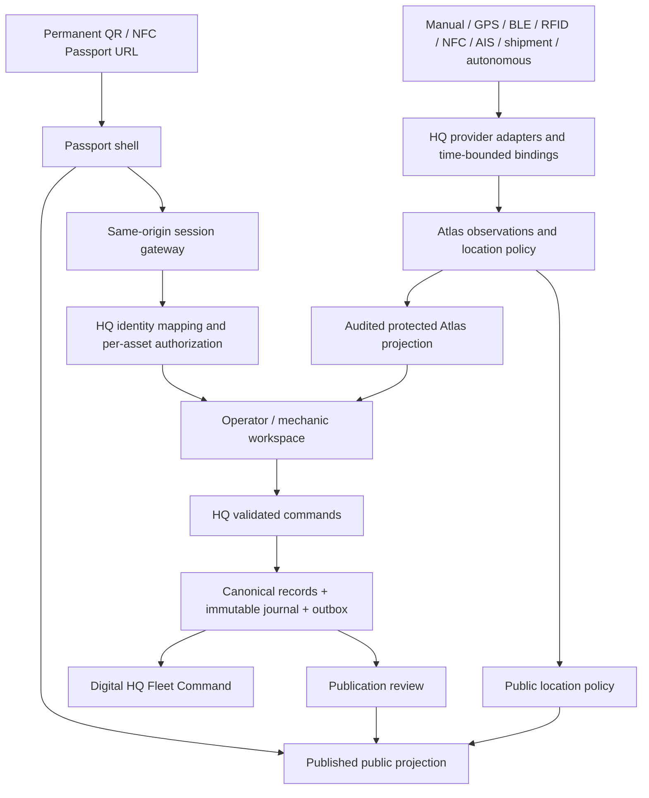
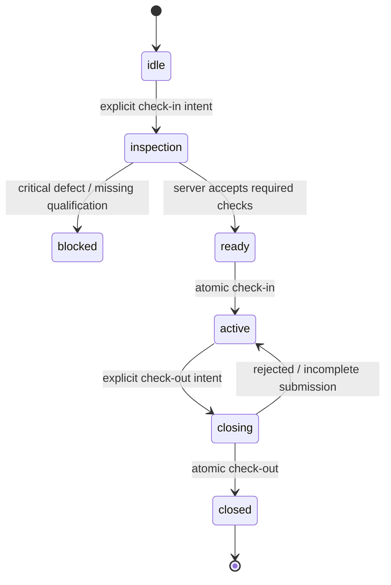

# Architecture

## Ownership and data flow

| Domain | Authority | Passport responsibility |
| --- | --- | --- |
| Identity, URL and tag associations | Existing HQ equipment row; reconcile existing identifiers | Resolve/render; never allocate an inventory ID |
| Operator, crew, project, job, customer and assignment | Existing HQ/SPGo records and dispatch policy | Read authorized references and submit commands |
| Location and observation provenance | Atlas within HQ | Render normalized context and freshness |
| Shift, inspection, meter and attachment transactions | HQ operations services | Capture intent, validate usability, show server result |
| Maintenance, parts, warranty, work orders | Existing HQ service records | Mechanic workspace and approved public summary |
| Evidence, media and documents | Canonical evidence service with visibility policy | Fetch only authorized representations |
| Permanent journey | Append-only domain journal plus imported source references | Chronological projection with corrections |

This is an interface and extension of existing systems. Before implementing persistence, map each proposed aggregate to its existing HQ/SPGo owner; add missing fields/tables only after that audit. No new equipment, operator, job or customer registry is proposed. Public `fleetId`, `passportId`, URL and HQ `assetId` are distinct identifiers with a validated one-to-one mapping. Treat HQ IDs as opaque strings; verify actual SQL type/width before any migration.

## One URL, role-aware entry

1. Resolve the unchanged public route and immediately render the existing published Passport.
2. An optional same-origin backend gateway asks for session plus asset capabilities. Anonymous `401` leaves the public record intact. Timeout shows a retry/sign-in entry, not cached internal data. `403` denies this asset; `404` uses a non-enumerating unavailable response.
3. An authorized operator receives the operator workspace and a check-in prompt. A mechanic receives the service workspace. A person with both capabilities may switch between these workspaces without changing asset or URL. An authenticated viewer without operate/service grants receives only the permitted read view.
4. Never start a shift on scan, page load, geofence entry or login. Require an explicit confirmation after inspection and assignment validation.
5. Sign-in returns to an allowlisted local Passport path, retaining safe history anchors. QR and NFC contain only the public URL; printed tags never embed tokens, provider identifiers or operational routes. RFID resolves through an authenticated, audited reader association to the same identity.
6. Logout, session expiry, tenant change or asset change aborts in-flight private requests and removes private state, media URLs and DOM. Revalidate on tab focus/back navigation. Client permission checks aid UX; every server read and write enforces permission independently.

The future API in this package sits behind a **same-origin session gateway** at `/api/passport/v1`. Static hosting currently has no such gateway. Provisioning it and integrating the existing identity provider are migration prerequisites. Use HttpOnly, Secure, appropriately scoped SameSite cookies; do not use localStorage bearer tokens or `?operator=1`. Mutations require session-bound CSRF protection, exact-origin validation and an idempotency key. Do not broaden CORS or share an admin cookie across unrelated applications to make the prototype work.

## Capabilities and privacy

| Capability | Protected use |
| --- | --- |
| `passport.operations.read` | Asset mission, assigned crew, hours and active shift |
| `passport.shift.write` | Own eligible check-in/check-out, asset-scoped |
| `passport.inspection.write` | Versioned pre-operation and safety inspection |
| `passport.incident.write` | Fuel, damage, photos, service request |
| `passport.attachment.write` | Compatible attachment association change |
| `passport.service.read` / `.write` | Mechanic records and authorized service commands |
| `fleet.location.read_exact` / `.read_history` | Atlas exact location / trail; successful audit required |
| `fleet.command.read` | HQ fleet view within assigned organizational scope |

These new `passport.*` grants are proposals to map onto existing permission policy, not grants created here. Authenticated does not mean authorized for every asset or every location field. Customer/crew labels are returned only when assignment scope permits. A mechanic need not receive customer address or operator trail to read a manual. Client code must not download a private superset and hide it with CSS.

All private HTTP responses, including errors and downloads, use `Cache-Control: private, no-store`; no CDN, service worker or public static build caches them. Logs/analytics exclude signatures, customer details, coordinates, free text and media URLs. Private photos stay private; public derivatives require review, metadata/EXIF removal and an explicit allowlist. Public service summaries omit operators, signatures, job sites, customer details, defect narratives and internal costs. Future trail access needs separately reviewed purpose, retention and audit policy; this design does not activate trails or worker tracking.

## Atlas: one location authority, interchangeable providers

Atlas returns a normalized location projection: position when permitted, region, yard, facility, geofence, movement timestamp, confidence, freshness and provenance. Mission/job/customer/project/crew remain authoritative HQ assignments joined into that projection; a nearby geofence must never silently reassign a customer or job. Mission status and location freshness are separate fields.

Adapters are registered server-side by stable provider ID and capabilities. The UI never switches on vendor name or fleet ID. Configuration defines binding validity, trusted reader locations, precision, freshness limits and source priority by asset profile. Credentials and raw provider payloads stay in HQ.

| Provider family | Normalized evidence | Limitation |
| --- | --- | --- |
| Manual | Authenticated declaration; optional device location and accuracy | Declared location is not a verified GPS fix |
| GPS | Timestamped fix, accuracy, device binding | Stale fix is last known, not current |
| BLE | Proximity to trusted gateway | No invented coordinate precision |
| RFID / NFC | Authenticated reader/tag observation | Tag scan alone proves neither operator nor machine custody |
| AIS | Vessel observation linked by reviewed voyage binding | Vessel position does not prove cargo location after discharge |
| Shipment | Reviewed milestone and coarse checkpoint | No inferred delivery, clearance or commissioning |
| Autonomous | Signed observations through capability adapter | Telemetry does not grant remote command authority |

`LocationProvider` interface: `capabilities()`, `normalize(raw, binding)`, optional `poll(cursor)` and `verifyWebhook(request)`. `normalize` emits `LocationObservation` or a quarantined validation failure. Provider credentials and webhook verification are implementation-specific; no public browser ingestion endpoint is proposed. Adapters use observed and received times, unit normalization, deduplication, anti-replay and time-bounded asset/device bindings. Unsupported capability returns unavailable, not fabricated telemetry.

Selection policy rejects invalid/revoked bindings and unreasonable timestamps; applies configured source freshness and precision rules; retains contradictory observations; and returns `conflict` instead of silently averaging incompatible locations. Stale/missing providers do not erase evidence. Show observed time and last-known label. A recorded scan with no location stays location-null. Map overlays consume normalized capabilities; future GPS trail, operator trail and health panels remain absent until the server grants and supplies them.

## Check-in and shift state

In v1, **Start shift / Check in** is one command and **End shift / Check out** is one command. If payroll shifts later span multiple assets, separate personnel time from asset operating sessions rather than overloading these records.

Asset profiles declare applicable meter units, fuel, signature requirements, inspection templates and attachment actions. A tool or unmetered trailer uses explicit null meter values, never a fabricated zero. The server rejects null values when the assigned profile requires evidence; the client cannot choose a weaker profile. Optional capabilities disappear from the workspace rather than becoming machine-specific branches.

Check-in binds the authenticated actor, canonical asset, assigned job/mission, versioned passing inspection, meter reading, evidence photos and private signature reference. Server records accepted UTC time and snapshots the authoritative Atlas region/observation; the device supplies a separately labeled capture time and optional location. Signature is a consent artifact, never authentication. Denied device-location permission follows an explicit site-policy fallback (manual attestation/review), not zero coordinates or an implicit bypass.

Within one transaction, HQ checks asset eligibility/commissioning, operator qualification/assignment, safety locks, current version and exclusivity. Enforce one active primary operating session per asset and one per operator by default; crew presence is separate. Any exception requires an explicit policy/override event. Two concurrent scans cannot both claim the machine. Idempotency scope is actor + asset + command; same key/different body conflicts, and retries return the prior accepted result. Server validates evidence ownership, upload completion and inspection template version, not just field presence.

Check-out collects closing meter, fuel amount/unit, photos, damage, notes, attachment references and maintenance issues. Meter readings are not elapsed wall time: derive meter delta from valid readings and record operating-session duration separately. Reject decreases unless a reviewed meter replacement/correction explains them. Hours today use the asset's configured timezone and accepted meter events, with unknown shown explicitly.

The checkout transaction closes the session, records meter/fuel/attachment events, appends a service activity and raises maintenance/work-order requests for reported defects. A defect is **reported**, never automatically repaired or cleared. Critical defects set the safety lock for the next start under policy. Service completion requires authorized mechanic evidence and separate return-to-service approval where required. Validate attachment identity, compatibility and exclusive assignment before changing the association; preserve installed/removed intervals.

Use a transactional outbox for Fleet Command and public-summary projection. A worker retries with event IDs; consumers deduplicate. If a remote service system is unavailable, persist the accepted report and pending service-sync state in the same transaction, expose the delay, and do not claim a work order exists until acknowledged. Failed transactions produce no partial checkout. Client state changes only after server acceptance. Offline v1 may display the public Passport but cannot claim an accepted shift; later encrypted offline drafts need conflict resolution and replay review before activation.

## Permanent journey and service mode

Journal factory, shipment, delivery, commissioning, jobs, service, attachments and ownership as typed events with immutable ID, source reference, occurred/recorded timestamps, actor or system provenance, evidence and visibility. Unknown occurrence time remains null and is labeled recorded-time ordering. Stable sequence breaks ties; paginated cursors prevent duplicate/omitted rows. Corrections append `supersedesEventId`; originals remain auditable, not silently overwritten. Private evidence follows retention/access policy; permanent operational history does not imply permanent public access to personal data.

Mechanic mode shows open work orders, due maintenance, parts, warranty, manuals, bulletins and inspection forms. Asset-specific document authorization applies to each download. Closing a work order records parts, meter, work performed, evidence and approval; it does not implicitly close an operator shift or erase a defect. HQ Fleet Command reads the same accepted records, exposing projection timestamp, sync delay, machine, operator, mission, location, attachments, hours and service status. Future telemetry extends a versioned capability surface without changing the Passport identity.
