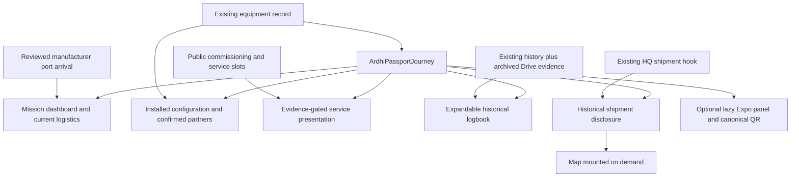

# SP-ARDHI-26 flagship architecture

The existing physical `/equipment/sp-ardhi-26.html` route, equipment identity `SP-ARDHI-26`, passport `SPP-2026-0001`, public projection and historical record are retained. This is a presentation evolution, not a new asset database.

## Ownership and evidence

- `equipment.ts` remains the source for machine identity, configuration, installed bucket/forks, manufacturer relationship, documents and gallery. The future-attachment presentation checks canonical installation status before changing its grey state.
- `ardhiPortArrival.ts` is the reviewed October 9 manufacturer-confirmation snapshot. Its occurrence date remains null. Customs, warehouse transfer, delivery, commissioning and readiness remain pending. The older HQ feed is retained in a separately labeled historical disclosure; it is not silently rewritten or treated as the newer cargo record.
- `ardhiFlagship.ts` defines public presentation slots for twelve commissioning checks, the empty service grid and first-job record. There is no browser-side data entry, local persistence, hidden approval mechanism or new API. An operational HQ adapter remains future integration work.
- Evidence must be explicitly verified, named and linked to a public equipment document or historical anchor to qualify. Project 001 requires all twelve distinct commissioning checks and the completed job to have qualifying public evidence. A date, completion flag, repeated check or pending attachment cannot unlock it.
- Plans for customers, automation, attachments, Tri-Lift, freight and sponsorship remain labeled planned/pending/open. They do not enter the confirmed partner array or assert operational readiness.

## Rendering and navigation

The DOM and visual order agree: hero → dashboard → one five-link rail → identity/mission/capabilities → mission timeline/current journey → history/archive → fleet ecosystem → service → documents. The old flex `order` rules are bypassed only for ARDHI v4. No competing hero tabs, duplicated status ribbon or second sticker launch card remains.

The established history IDs and injected Drive evidence stay intact. History is collapsed until opened or reached through a `#history-*` or `#drive-*` deep link. Archive chapter selection is a labeled select rather than another navigation rail. Specifications and the existing manufacturer profile retain their original integration.

`?expo=1` enables the same page's Expo panel. It has a large QR with a white quiet zone and a readable link to `https://smashpro.app/equipment/sp-ardhi-26.html`. Leaving Expo removes only that query parameter. No separate Expo asset or competing public identity is created.

## Performance and accessibility

Historical map/vessel UI mounts after opening its disclosure. Expo is a separate lazy-loaded bundle. Images retain native lazy loading, archive videos use `preload="none"`, and long archive/history rendering uses content visibility while preserving the legacy evidence injection. This does not claim that the entire history JavaScript is fetched lazily.

Native disclosure controls, labeled selection, textual status, semantic lists/definition lists/table roles, visible focus, Escape dismissal and focus return support keyboard use. Lightbox focus is contained; sticker dialog retains its existing focus trap. Reduced-motion preferences disable transitions and the bounded mission-progress animation. Print rules suppress the new sections while printing the sticker.

## Boundaries

No deployment workflow, shared Passport CSS, MZIGO renderer, source-evidence history block or index validator was changed for v4. The commit includes the reviewed prerequisite October 9 arrival changes copied from the original dirty checkout; unrelated PCM/UMBA files were excluded. Original checkout work remains in place.

Future work: bind the public commissioning/service slots to the approved HQ projection; reconcile HQ shipment state against manufacturer confirmation; migrate legacy DOM history/manufacturer enhancement to declarative rendering with parity coverage; optimize the large existing hero/shared bundles; perform physical phone, printed QR and production acceptance. Trailer links currently lead to the fleet catalog because no verified trailer passport exists in this source.
