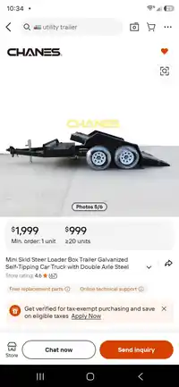
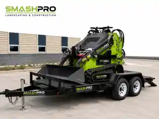

# SP-INAMA-26 Media and Source Reference Register

> **Canonical role:** This file catalogs planning media and supplier-reference imagery for proposed Fleet Asset **SP-INAMA-26**. None of the media below is completed-build evidence, an engineering drawing, or proof of the negotiated trailer specification.
>
> **Status:** Pre-purchase planning media  
> **Last updated:** 2026-08-22  
> **Passport:** [SP-INAMA-26-PASSPORT.md](SP-INAMA-26-PASSPORT.md)  
> **Procurement record:** [SP-INAMA-26-PROCUREMENT.md](SP-INAMA-26-PROCUREMENT.md)

---

## 1. Asset Register

| Asset | Repository file | Classification | Source | Approved role |
| --- | --- | --- | --- | --- |
| Alibaba listing screenshot | [Supplier listing reference preview](evidence/sp-inama-26-alibaba-listing-reference-2026-08-22-preview.webp) | Supplier marketplace reference | User-supplied screenshot of the CHANES Alibaba listing | Procurement/source reference only |
| SmashPro trailer mockup | [Concept mockup preview](../../images/sp-inama-26-concept-mockup-preview.webp) | SmashPro concept render | User-supplied mockup showing SP-ARDHI-26 on a branded low-profile trailer | Private page-planning and visual-direction reference only |

The repository files are web-optimized preview derivatives. They do not replace the original source uploads or establish technical facts.

---

## 2. Supplier Listing Reference

### Visible listing information

| Field | Recorded observation |
| --- | --- |
| Listing/storefront mark | **CHANES** |
| Product title shown | “Mini Skid Steer Loader Box Trailer Galvanized Self-Tipping Car Truck with Double Axle Steel” |
| Displayed one-unit marketplace price | $1,999 |
| Displayed 20-unit marketplace tier | $999 per unit |
| Store rating shown | 4.6, with 67 displayed reviews |
| Listing image | Generic low-profile tandem-axle self-tipping trailer with standard white wheels |
| Source received | 2026-08-22 |

### Evidence limits

- **CHANES is recorded only as the visible supplier/listing mark.** The legal supplier entity, manufacturer, country of manufacture, and factory model remain pending the Alibaba Trade Assurance order and manufacturer documents.
- The displayed marketplace prices are generic listing tiers. They do **not** supersede or reduce the negotiated **$5,050 DDP** custom SP-INAMA-26 configuration.
- The listing image is a supplier reference unit, not a photograph of the future SP-INAMA-26 build.
- The screenshot does not verify deck dimensions, tare weight, GVWR, payload, axle ratings, brake configuration, coupler rating, tie-down ratings, VIN, compliance, DDP scope, rack design, or delivered accessories.
- The screenshot must not be used as the public hero image or as proof that the final trailer is manufactured, ordered, registered, or road-ready.

---

## 3. SmashPro Concept Mockup

### Concept direction shown

- SP-ARDHI-26 positioned on a low-profile tandem-axle trailer
- Black trailer presentation with SmashPro branding
- Standard white wheels
- Lowered rear deck with no separate loading ramps depicted
- No water tank depicted
- Compact equipment-transport mission communicated clearly

### Known concept limitations

The mockup is a visual concept, not an engineering drawing or final build depiction. It currently shows or omits details that differ from, or remain unresolved in, the negotiated configuration:

- A **manual tongue jack appears**, while the negotiated specification calls for an **electric tongue jack**.
- The negotiated **removable equipment rack is not depicted**.
- The front tongue/battery toolbox is not clearly documented in the image.
- Tie-down quantity, locations, and working-load limits cannot be verified.
- Electric brakes on both axles, the breakaway battery, American 7-pin connector, safety-chain ratings, VIN plate, manufacturer plate, and registration/import documents cannot be verified visually.
- The image does not prove the 4,500 × 2,000 mm deck, 1,000 kg tare, 3,000 kg GVWR, or 2,000 kg payload.
- Trailer finish, structure, fenders, hydraulic geometry, and component placement remain subject to the accepted order, final drawing, and production evidence.

### Approved use

- Use as an internal visual-direction reference.
- Use as a private equipment-page placeholder only after the Trade Assurance order is accepted, and label it **Concept** in the image caption and accessible text.
- Do not present it as a factory photograph, completed build, engineering drawing, or final delivered configuration.
- Replace it with verified production or completed-trailer media as soon as that evidence exists.

---

## 4. Equipment Passport Page Media Gate

Before the concept mockup is connected to `src/data/equipment.ts` or any compatibility page:

- [ ] Alibaba Trade Assurance order has been accepted and reconciled with the procurement record.
- [ ] The page remains private or otherwise excluded from the public catalog and sitemap unless SmashPro explicitly approves release.
- [ ] Equipment status remains `planned`.
- [ ] Caption and alt text identify the image as a concept mockup.
- [ ] Generic Alibaba listing prices are not displayed as the SP-INAMA-26 purchase price.
- [ ] The supplier listing screenshot is used only as a source reference, not a hero or gallery marketing asset.
- [ ] Water tank, loading ramps, black wheels, or other excluded/unconfirmed features are not added through inference.
- [ ] The mockup's manual jack and missing rack are not mistaken for the final accepted configuration.
- [ ] Verified production media replaces concept media when available.

---

## 5. Future Media Requests

- Full-resolution, page-ready concept hero with a visible **Concept** designation
- Corrected mockup showing the electric tongue jack and accepted rack design after the rack drawing is approved
- Approved branding proof
- Factory progress photographs and video
- Hydraulic lowering demonstration
- Completed trailer walkaround
- VIN and manufacturer plate photographs
- Axle, tire, brake, coupler, chain, jack, toolbox, tie-down, lighting, and connector detail photographs
- Shipping preparation and arrival inspection media

---

## 6. Revision History

| Date | Change |
| --- | --- |
| 2026-08-22 | Added the user-supplied CHANES Alibaba listing screenshot and SmashPro trailer mockup as separately classified supplier-reference and concept-planning media. |
